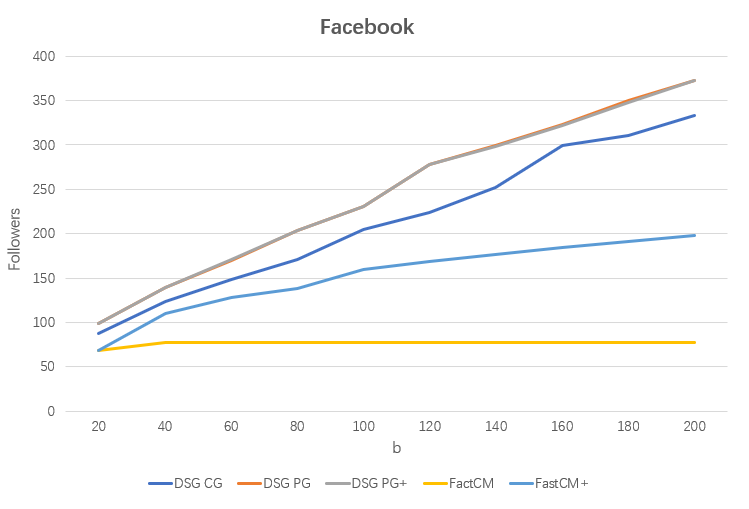
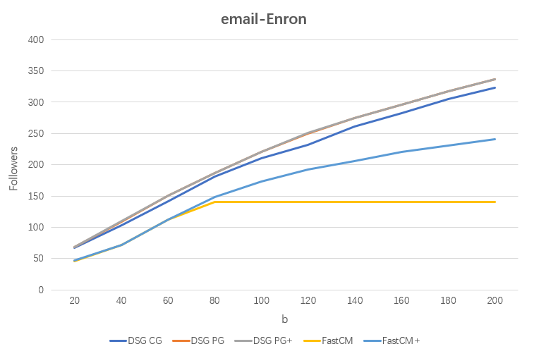
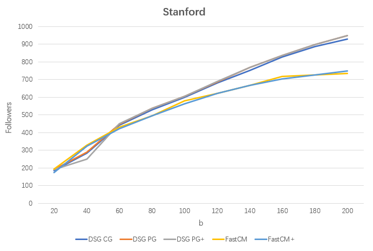

## 1.Effectiveness evaluation by varying budget b.
We conducted experiments on three different types of graphs to demonstrate the effectiveness of our approach, fixing $k=20$ while varying $b$, as follows:
### Table 1: Facebook

  

    <table>
      <thead>
        <tr>
          <th>b</th>
          <th>FastCM</th>
          <th>FastCM+</th>
          <th>DSG CG</th>
          <th>DSG PG</th>
          <th>DSG PG+</th>
        </tr>
      </thead>
      <tbody>
        <tr><td>20</td><td>69</td><td>69</td><td>88</td><td>99</td><td>99</td></tr>
        <tr><td>40</td><td>77</td><td>110</td><td>124</td><td>139</td><td>139</td></tr>
        <tr><td>60</td><td>77</td><td>128</td><td>148</td><td>170</td><td>171</td></tr>
        <tr><td>80</td><td>77</td><td>138</td><td>171</td><td>204</td><td>204</td></tr>
        <tr><td>100</td><td>77</td><td>160</td><td>205</td><td>231</td><td>231</td></tr>
        <tr><td>120</td><td>77</td><td>169</td><td>224</td><td>278</td><td>278</td></tr>
        <tr><td>140</td><td>77</td><td>177</td><td>252</td><td>299</td><td>298</td></tr>
        <tr><td>160</td><td>77</td><td>185</td><td>299</td><td>323</td><td>322</td></tr>
        <tr><td>180</td><td>77</td><td>190</td><td>311</td><td>350</td><td>348</td></tr>
        <tr><td>200</td><td>77</td><td>198</td><td>333</td><td>373</td><td>373</td></tr>
      </tbody>
    </table>
  

  

    
  

---

### Table 2: email-Enron

  

    <table>
      <thead>
        <tr>
          <th>b</th>
          <th>FastCM</th>
          <th>FastCM+</th>
          <th>DSG CG</th>
          <th>DSG PG</th>
          <th>DSG PG+</th>
        </tr>
      </thead>
      <tbody>
        <tr><td>20</td><td>46</td><td>47</td><td>67</td><td>69</td><td>69</td></tr>
        <tr><td>40</td><td>72</td><td>72</td><td>103</td><td>109</td><td>110</td></tr>
        <tr><td>60</td><td>112</td><td>112</td><td>142</td><td>151</td><td>151</td></tr>
        <tr><td>80</td><td>140</td><td>148</td><td>181</td><td>187</td><td>187</td></tr>
        <tr><td>100</td><td>140</td><td>173</td><td>210</td><td>221</td><td>221</td></tr>
        <tr><td>120</td><td>140</td><td>192</td><td>232</td><td>250</td><td>251</td></tr>
        <tr><td>140</td><td>140</td><td>206</td><td>261</td><td>275</td><td>275</td></tr>
        <tr><td>160</td><td>140</td><td>220</td><td>282</td><td>296</td><td>296</td></tr>
        <tr><td>180</td><td>140</td><td>231</td><td>305</td><td>317</td><td>317</td></tr>
        <tr><td>200</td><td>140</td><td>241</td><td>323</td><td>337</td><td>337</td></tr>
      </tbody>
    </table>
  

  

    
  

---

### Table 3: Stanford

  

    <table>
      <thead>
        <tr>
          <th>b</th>
          <th>FastCM</th>
          <th>FastCM+</th>
          <th>DSG CG</th>
          <th>DSG PG</th>
          <th>DSG PG+</th>
        </tr>
      </thead>
      <tbody>
        <tr><td>20</td><td>195</td><td>174</td><td>185</td><td>190</td><td>192</td></tr>
        <tr><td>40</td><td>330</td><td>324</td><td>285</td><td>289</td><td>249</td></tr>
        <tr><td>60</td><td>430</td><td>423</td><td>442</td><td>446</td><td>450</td></tr>
        <tr><td>80</td><td>496</td><td>486</td><td>530</td><td>538</td><td>538</td></tr>
        <tr><td>100</td><td>580</td><td>563</td><td>598</td><td>606</td><td>606</td></tr>
        <tr><td>120</td><td>622</td><td>622</td><td>682</td><td>687</td><td>690</td></tr>
        <tr><td>140</td><td>667</td><td>668</td><td>750</td><td>768</td><td>768</td></tr>
        <tr><td>160</td><td>718</td><td>727</td><td>827</td><td>835</td><td>835</td></tr>
        <tr><td>180</td><td>726</td><td>727</td><td>885</td><td>899</td><td>899</td></tr>
        <tr><td>200</td><td>734</td><td>747</td><td>929</td><td>948</td><td>948</td></tr>
      </tbody>
    </table>
  

  

    
  

Our algorithm performs optimally in all scenarios. Furthermore, as $b$ increases, the advantage of our method over FastCM/FastCM+ becomes more apparent. This is because, with the increase of $b$, the number of candidate $\lambda$-shell components gradually increases, and the number of edges spanning across these components also grows. Our algorithm can effectively utilize these additional edges, which previous algorithms could not exploit. Additionally, we observed that the performance of DSG PG+ is comparable to that of DSG PG, which further validates the effectiveness of our offline storage strategy.

## 2.Efficiency evaluation by varying budget b.
We evaluate the efficiency of all algorithms in the following tables:

### Table 4: Facebook
| b | FastCM | FastCM+ | DSG CG | DSG PG | DSG PG+ |
|-------|--------|---------|--------|--------|---------|
| 20    | 0.002     | 0.002     | 0.002    | 0.047    | 0.002     |
| 40    | 0.003     | 0.005     | 0.004    | 0.058    | 0.004     |
| 60    | 0.003     | 0.005     | 0.005    | 0.069    | 0.005     |
| 80    | 0.002     | 0.006     | 0.007    | 0.073    | 0.006     |
| 100   | 0.003     | 0.008     | 0.006    | 0.087    | 0.006     |
| 120   | 0.003     | 0.008     | 0.012    | 0.093    | 0.006     |
| 140   | 0.003     | 0.008     | 0.012    | 0.112    | 0.007     |
| 160   | 0.003     | 0.008     | 0.016    | 0.117    | 0.007     |
| 180   | 0.003     | 0.008     | 0.011    | 0.121    | 0.01      |
| 200   | 0.003     | 0.008     | 0.023    | 0.131    | 0.007     |
### Table 5: email-Enron
| b | FastCM | FastCM+ | DSG CG | DSG PG | DSG PG+ |
|-------|--------|---------|--------|--------|---------|
| 20    | 0.024     | 0.023     | 0.004    | 0.422    | 0.006     |
| 40    | 0.022     | 0.022     | 0.004    | 1.159    | 0.008     |
| 60    | 0.021     | 0.022     | 0.004    | 1.109    | 0.009     |
| 80    | 0.025     | 0.053     | 0.008    | 1.381    | 0.011     |
| 100   | 0.021     | 0.045     | 0.007    | 1.488    | 0.013     |
| 120   | 0.021     | 0.046     | 0.008    | 1.616    | 0.014     |
| 140   | 0.021     | 0.044     | 0.008    | 1.716    | 0.015     |
| 160   | 0.021     | 0.045     | 0.007    | 1.715    | 0.015     |
| 180   | 0.021     | 0.045     | 0.007    | 1.941    | 0.017     |
| 200   | 0.021     | 0.045     | 0.007    | 2.325    | 0.018     |
### Table 6: Stanford
| b | FastCM | FastCM+ | DSG CG | DSG PG | DSG PG+ |
|-------|--------|---------|--------|--------|---------|
| 20    | 0.268     | 0.317     | 0.035    | 4.048    | 0.051     |
| 40    | 0.286     | 0.29      | 0.038    | 4.269    | 0.05      |
| 60    | 0.338     | 0.311     | 0.038    | 4.278    | 0.05      |
| 80    | 0.287     | 0.29      | 0.039    | 3.949    | 0.054     |
| 100   | 0.288     | 0.288     | 0.043    | 6.177    | 0.058     |
| 120   | 0.294     | 0.293     | 0.041    | 6.702    | 0.066     |
| 140   | 0.297     | 0.293     | 0.041    | 5.709    | 0.058     |
| 160   | 0.294     | 0.297     | 0.044    | 6.314    | 0.06      |
| 180   | 0.29      | 0.292     | 0.047    | 6.864    | 0.059     |
| 200   | 0.292     | 0.294     | 0.05     | 8.223    | 0.058     |

These results indicate that DSG PG+ maintains the high performance of DSG PG while offering a much faster processing speed.
## 3.Effectiveness evaluation by varying parameter k.
It is important to note that the variation of $k$ is not directly related to the number of followers. We conducted these experiments to demonstrate that our method can handle different values of $b$ under various scenarios, where we kept $b$ fixed at 50 and varied $k$. The experimental results are as follows:
### Table 7: Facebook
| k   | FastCM  | FastCM+ | DSG CG | DSG PG |
|-----|---------|---------|--------|--------|
| 10  | 118   | 118   | 149  | 160  |
| 15  | 141   | 167   | 210  | 226  |
| 20  | 77    | 120   | 139  | 157  |
| 25  | 14    | 87    | 190  | 197  |
| 30  | 23    | 53    | 64   | 109  |
### Table 8: email-Enron
| k   | FastCM  | FastCM+ | DSG CG | DSG PG |
|-----|---------|---------|--------|--------|
| 10  | 222   | 221   | 256  | 284  |
| 15  | 145   | 145   | 170  | 184  |
| 20  | 92    | 92    | 123  | 131  |
| 25  | 105   | 125   | 131  | 142  |
| 30  | 91    | 121   | 112  | 150  |
### Table 9: Stanford
| k   | FastCM  | FastCM+ | DSG CG | DSG PG |
|-----|---------|---------|--------|--------|
| 10  | 466   | 437   | 508  | 512  |
| 15  | 484   | 477   | 524  | 524  |
| 20  | 389   | 379   | 388  | 394  |
| 25  | 348   | 331   | 323  | 317  |
| 30  | 442   | 440   | 492  | 506  |
## 4.case study
